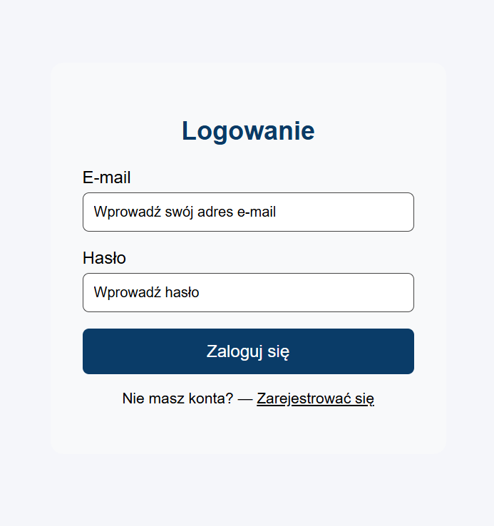

## fund_app
Приложение для управления финансами

## Описание

Проект предназначен для управления пользовательскими финансами.
Поддерживает регистрацию, авторизацию, просмотр баланс и защиту.

## Установка

1. Склонировать репозиторий:

```
https://github.com/denys-shpoltakov/fund_app.git
```

2. Перейти в папку проекта

```
cd fund_app
```

3. Открыть XAMPP и включите MYSQL & Apache

4. Настроить базу данных

```markdown

- Перейти на страницу http://localhost/phpmyadmin
- Создать базу данных с названием schema
- Сделать импорт базы данных из папки sql файл schema.sql


### Использование / Ysage
```markdown
## Использование



- Открыть в браузере `http://localhost/fund_app/public/index.php`
- Ввести email и пароль
- После успешной авторизации откроется панель пользователя (Dashboard)